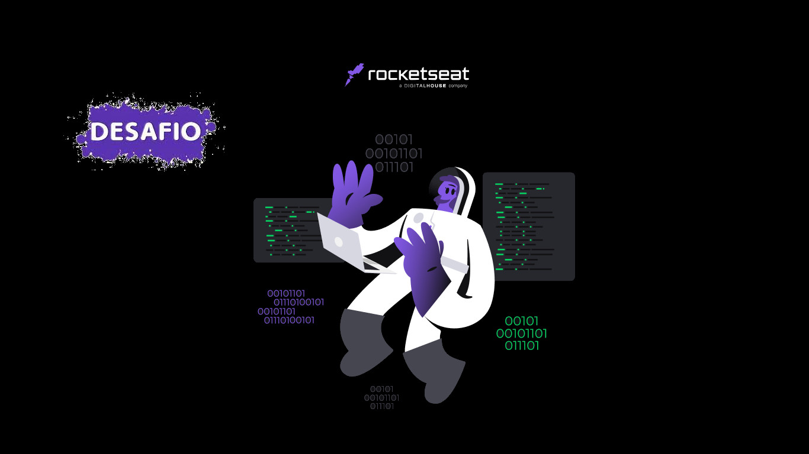

<h1 align="center"> DevLinks Desafio </h1>

Fazer alterações no layout original do progeto e enviá-lo a Rocketseat.

  <a href="#-tecnologias">Tecnologias</a>&nbsp;&nbsp;&nbsp;|&nbsp;&nbsp;&nbsp;
  <a href="#-projeto">Projeto</a>&nbsp;&nbsp;&nbsp;|&nbsp;&nbsp;&nbsp;
  <a href="#-layout">Layout</a>&nbsp;&nbsp;&nbsp;|&nbsp;&nbsp;&nbsp;
  <a href="#memo-licença">Licença</a>

  

 

  

## 🚀 Tecnologias

Esse projeto foi desenvolvido com as seguintes tecnologias:

- HTML e CSS
- JavaScript
- Git e Github
- Figma
- VScode
- Gimp

## 💻 Projeto

Esta versão do DevLinks foi um desafio proposto pela Rocketseat para ser enviado no final do curso.

## 🔖 Layout

Você pode visualizar o layout original do projeto através [DESSE LINK](https://www.figma.com/file/tyIpjd8iZCkbcBETDXthPQ/DevLinks-%E2%80%A2-Projeto-Discover-(Community)?type=design&node-id=1439-686&t=qPaeGNPHqQRup81L-0). É necessário ter conta no [Figma](https://figma.com) para acessá-lo.

## :memo: Licença

Esse projeto está sob a licença MIT.

---

Feito com ♥ by Rocketseat :wave: [Participe da nossa comunidade!](https://discord.gg/rocketseat)